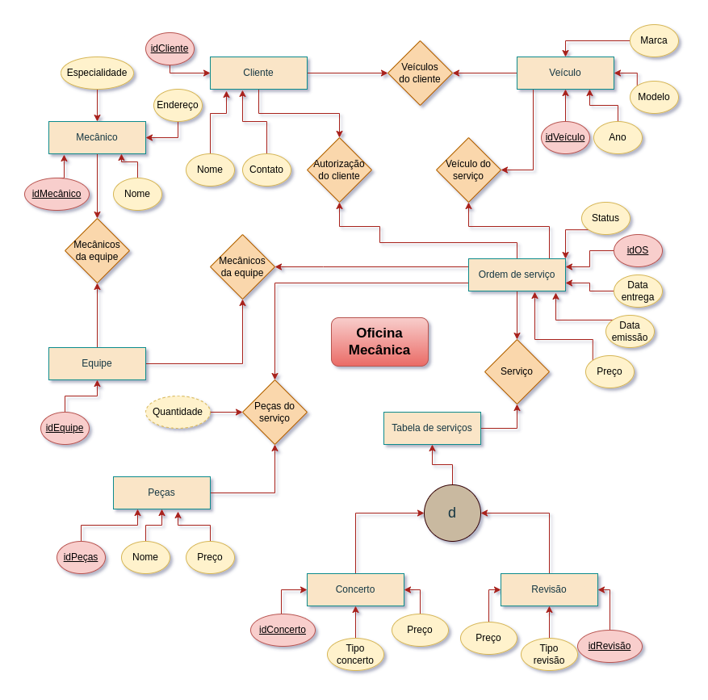

# 🛠️ Modelagem de Banco de Dados: Oficina Mecânica

  
  
  

 

> **Objetivo:** Projetar a arquitetura conceitual e lógica (Schema EER e UML) de um banco de dados relacional completo para atender as regras de negócio de um sistema de controle e gerenciamento de ordens de serviço (OS) em uma Oficina Mecânica.

---

## 🎯 Visão Geral do Projeto

Um banco de dados bem desenhado é o coração de qualquer sistema de gestão eficiente. Neste projeto, demonstro a capacidade de analisar requisitos narrativos de um cliente e convertê-los em entidades, atributos e relacionamentos matemáticos (1:N, N:N) sólidos e normalizados, utilizando o **MySQL Workbench** (`.mwb`).

👉 **[Fazer o download do Arquivo do Modelo (.mwb)](oficina-mecanica.mwb)**

---

## 📖 Regras de Negócio (A Narrativa)

O desenho da arquitetura precisou contemplar o seguinte escopo de negócio:

- Clientes trazem veículos à oficina mecânica para **consertos ou revisões periódicas**.
- Cada veículo é designado a uma **equipe de mecânicos** que identifica os serviços a serem executados e preenche uma **Ordem de Serviço (OS)** com data de entrega.
- O valor da OS é calculado cruzando uma **tabela de referência de mão-de-obra** e o **valor de cada peça** necessária.
- O cliente precisa **autorizar** a execução da OS.
- A mesma equipe que avalia é a que executa os serviços.
- Os mecânicos possuem código, nome, endereço e uma especialidade técnica.

---

## 🏗️ A Arquitetura (Schema)

A partir da narrativa, o banco de dados foi mapeado da seguinte forma:

### 🧩 Entidades e Atributos Principais

| Entidade | Principais Atributos |
| :--- | :--- |
| **OS** | Número (PK), Data de Emissão, Valor Total, Status, Data de Entrega |
| **Cliente** | ID (PK), Nome, Contato |
| **Veículo** | ID (PK), Modelo, Marca, Ano |
| **Equipe** | ID (PK) |
| **Mecânico** | ID (PK), Nome, Endereço, Especialidade |
| **Serviços (Tabela)** | ID (PK), Categoria (Conserto/Revisão), Descrição, Valor |
| **Peças** | ID (PK), Nome da Peça, Valor da Peça |

### 🔗 Relacionamentos Mapeados

- `[Mecânico] N:1 [Equipe]`: Composição das equipes da oficina.
- `[Equipe] 1:N [OS]`: Qual equipe é responsável técnica por qual OS.
- `[Veículo] N:1 [Cliente]`: Um cliente pode ter múltiplos carros, mas o carro pertence a apenas um dono no sistema.
- `[OS] N:1 [Veículo]`: Histórico de todas as manutenções de um carro específico.
- `[OS] N:1 [Cliente]`: Ligação direta para controle de Autorização de orçamento.
- `[OS] N:N [Serviços]`: Quais serviços (mão-de-obra) foram executados em uma ordem.
- `[OS] N:N [Peças]`: Quais peças foram substituídas em uma ordem.

---

## 🗺️ Diagramas Entidade-Relacionamento

Abaixo, a documentação visual do mapeamento gerado, validando a arquitetura proposta.

### 📐 Schema Lógico/Físico (EER)
A visão clássica do banco de dados (Tabelas, PKs, FKs e cardinalidade):

### 📊 Schema Conceitual (UML)
A abstração do sistema no mundo real:

---
*Este projeto integra meu portfólio de **Engenharia e Arquitetura de Dados**, comprovando proficiência em modelagem relacional de negócio.*
