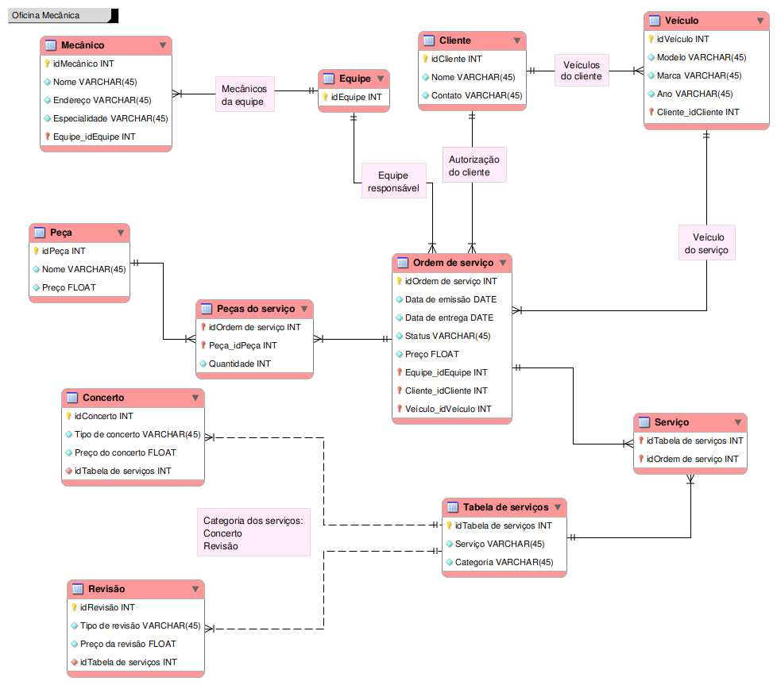

# 🛠️ Modelagem de Banco de Dados: Oficina Mecânica

!!! abstract "Objetivo"
    Projetar a arquitetura conceitual e lógica (Schema EER e UML) de um banco de dados relacional completo para atender as regras de negócio de um sistema de controle e gerenciamento de ordens de serviço (OS) em uma Oficina Mecânica.

---

## 🎯 Visão Geral do Projeto

Um banco de dados bem desenhado é o coração de qualquer sistema de gestão eficiente. Neste projeto, demonstro a capacidade de analisar requisitos narrativos de um cliente e convertê-los em entidades, atributos e relacionamentos matemáticos (1:N, N:N) sólidos e normalizados, utilizando o **MySQL Workbench** (`.mwb`).

👉 **[Fazer o download do Arquivo do Modelo (.mwb)](../oficina-mecanica.mwb)**

---

## 📖 Regras de Negócio (A Narrativa)

O desenho da arquitetura precisou contemplar o seguinte escopo de negócio:

=== "📋 Clientes e Veículos"
    - **Revisão:** Clientes trazem veículos à oficina para consertos ou revisões periódicas.
    - **Propriedade:** Um cliente pode possuir múltiplos veículos.
    - **Histórico:** Cada veículo tem seu histórico de OS vinculado.

=== "🔧 Equipes Técnicas"
    - **Composição:** Equipes são formadas por mecânicos com especialidades variadas.
    - **Responsabilidade:** A mesma equipe que avalia o problema é a que executa o serviço.
    - **Atributos:** Mecânicos possuem código, nome, endereço e uma especialidade técnica.

=== "📄 Ordens de Serviço (OS)"
    - **Emissão:** Contém número, data de emissão, valor total, status e data de entrega.
    - **Custo:** Calculado somando o valor dos serviços (mão-de-obra) e das peças necessárias.
    - **Autorização:** O cliente deve autorizar a execução da OS após o orçamento.

---

## 🏗️ A Arquitetura (Schema)

A partir da narrativa, o banco de dados foi mapeado da seguinte forma:

### 🧩 Entidades e Atributos Principais

| Entidade | Principais Atributos |
| :--- | :--- |
| **OS** | Número (PK), Data de Emissão, Valor Total, Status, Data de Entrega |
| **Cliente** | ID (PK), Nome, Contato |
| **Veículo** | ID (PK), Modelo, Marca, Ano |
| **Equipe** | ID (PK) |
| **Mecânico** | ID (PK), Nome, Endereço, Especialidade |
| **Serviços** | ID (PK), Categoria, Descrição, Valor |
| **Peças** | ID (PK), Nome da Peça, Valor da Peça |

### 🔗 Relacionamentos Mapeados

*   `[Mecânico] N:1 [Equipe]`: Composição técnica.
*   `[Equipe] 1:N [OS]`: Responsabilidade por serviço.
*   `[Veículo] N:1 [Cliente]`: Domínio de frota.
*   `[OS] N:1 [Veículo]`: Histórico de manutenção.
*   `[OS] N:N [Serviços/Peças]`: Detalhamento de execução.

---

## 🗺️ Diagramas Entidade-Relacionamento

### 📐 Schema Lógico/Físico (EER)
A visão clássica do banco de dados (Tabelas, PKs, FKs e cardinalidade):

### 📊 Schema Conceitual (UML)
A abstração do sistema no mundo real:

---
*Este projeto integra meu portfólio de **Engenharia e Arquitetura de Dados**, comprovando proficiência em modelagem relacional de negócio, desenvolvido por **Ariel Shlomoh**.*
